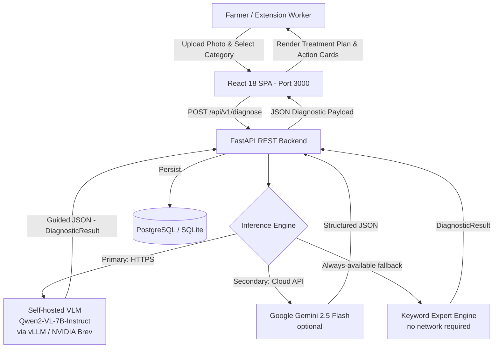

# AgriMind — AI-Powered Smart Agricultural Resource Engine
## Comprehensive Technical Documentation

---

## 1. EXECUTIVE SUMMARY & OVERVIEW

**AgriMind** is an enterprise-grade, full-stack agricultural decision-support engine designed for small-to-medium farmers, livestock managers, and agricultural extension officers.

It bridges raw farm telemetry (mortality tracking, feed consumption in kg, water usage in liters) with multimodal vision AI diagnostics using a **self-hosted open-weight VLM (Qwen2-VL-7B-Instruct)** served on an NVIDIA GPU via vLLM. AgriMind delivers non-hallucinated, hyper-local agronomic advice, disease identification, and structured treatment protocols for **Crops**, **Poultry**, and **Livestock**. Google Gemini 2.5 Flash is supported as an optional secondary cloud fallback.

### Key System Capabilities
- **Multimodal Visual Health Diagnostics:** Instant pathogen identification from photos (crop leaf blights, poultry coccidiosis/bronchitis, bovine mastitis) with confidence meters and severity classification.
- **Resource & Telemetry Tracking:** Daily mortality logs, feed-to-growth ratios (FCR), and water intake monitoring tied to active production batches.
- **Strict RAG & Precision Pathology:** Enforces verified agronomic standards, exact chemical proportions, water-mix ratios, safety warnings, and healthy specimen detection (`Low` risk, 95%+ confidence).
- **Resilient 3-Tier Inference:** Self-hosted VLM → Gemini API (optional) → Keyword fallback engine. Guarantees a meaningful diagnosis 100% of the time.

---


## 2. SYSTEM ARCHITECTURE & DATA FLOW



### Data Flow Execution Sequence

1. **User Action:** Farmer selects target category (`Poultry`, `Crops`, or `Livestock`), uploads a specimen photo, and optionally adds field-observation notes or links to an active batch.
2. **API Request:** Frontend issues `POST /api/v1/diagnose` as `multipart/form-data`.
3. **3-Tier AI Vision Pipeline:**
   - **Tier 1 — Self-hosted VLM:** `inference_client.VLMInferenceClient` sends the image + structured prompt to the OpenAI-compatible `/v1/chat/completions` endpoint (vLLM serving Qwen2-VL-7B-Instruct on an NVIDIA GPU). Guided JSON generation (`guided_json` / `structured_outputs`) constrains the output to `DiagnosticResult.model_json_schema()`.
   - **Tier 2 — Gemini 2.5 Flash (optional):** If the VLM endpoint is not configured or raises `InferenceError`, the engine falls back to the `google-genai` SDK (requires `GEMINI_API_KEY`).
   - **Tier 3 — Keyword Fallback Engine:** If both cloud paths are unavailable (no key, offline, timeout), a context-aware keyword matcher returns a fully populated `DiagnosticResult` immediately — zero latency, zero network.
4. **Data Persistence & Display:** Findings, severity badges, and structured treatment plans are persisted to the database and rendered dynamically on the React dashboard.

### Key New Files Introduced

| File | Purpose |
|---|---|
| `backend/app/inference_client.py` | Abstract `InferenceClient` interface + `VLMInferenceClient` concrete implementation |
| `backend/app/config.py` | pydantic-settings `BaseSettings` with `INFERENCE_*` env vars |
| `deploy/brev/docker-compose.yaml` | vLLM container deployment on NVIDIA Brev GPU |
| `deploy/brev/README.md` | Step-by-step Brev provisioning guide |
| `.env.example` | Documented template for all environment variables |

---


## 3. DATABASE SCHEMA (PostgreSQL / Supabase Ready)

The database schema is defined in `backend/schema.sql` and mirrored via SQLAlchemy models in `backend/app/database.py`.

```sql
CREATE EXTENSION IF NOT EXISTS "uuid-ossp";

-- Batches Table
CREATE TABLE IF NOT EXISTS batches (
    id UUID PRIMARY KEY DEFAULT uuid_generate_v4(),
    name VARCHAR(100) NOT NULL,
    batch_type VARCHAR(50) NOT NULL CHECK (batch_type IN ('Poultry', 'Crops', 'Livestock')),
    initial_quantity INT NOT NULL,
    current_quantity INT NOT NULL,
    status VARCHAR(20) DEFAULT 'Active' CHECK (status IN ('Active', 'Harvested', 'Quarantined')),
    created_at TIMESTAMP WITH TIME ZONE DEFAULT CURRENT_TIMESTAMP
);

-- Daily Logs Table
CREATE TABLE IF NOT EXISTS daily_logs (
    id UUID PRIMARY KEY DEFAULT uuid_generate_v4(),
    batch_id UUID REFERENCES batches(id) ON DELETE CASCADE,
    log_date DATE NOT NULL DEFAULT CURRENT_DATE,
    mortality_count INT DEFAULT 0,
    feed_consumed_kg NUMERIC(8, 2) DEFAULT 0.0,
    water_consumed_l NUMERIC(8, 2) DEFAULT 0.0,
    notes TEXT,
    created_at TIMESTAMP WITH TIME ZONE DEFAULT CURRENT_TIMESTAMP
);

-- Diagnostics Table
CREATE TABLE IF NOT EXISTS diagnostics (
    id UUID PRIMARY KEY DEFAULT uuid_generate_v4(),
    batch_id UUID REFERENCES batches(id) ON DELETE CASCADE,
    image_url TEXT,
    detected_issue VARCHAR(255) NOT NULL,
    severity VARCHAR(20) CHECK (severity IN ('Low', 'Medium', 'High', 'Critical')),
    confidence_score NUMERIC(5, 2),
    treatment_plan JSONB,
    created_at TIMESTAMP WITH TIME ZONE DEFAULT CURRENT_TIMESTAMP
);
```

---

## 4. MULTIMODAL AI ENGINE

The AI subsystem spans two files and implements a resilient 3-tier inference chain.

### `backend/app/inference_client.py` — Abstraction Layer

```
InferenceClient (ABC)
└── VLMInferenceClient
        ├── diagnose_image(image, category, notes) → DiagnosticResult
        ├── _build_payload()  — constructs OpenAI chat-completions body
        │                       with guided_json / structured_outputs
        ├── _post_with_retry() — async httpx POST with configurable retries
        └── _parse_response()  — extracts + validates JSON into DiagnosticResult
```

**Key design decisions:**
- `guided_json` + `extra_body.structured_outputs` are sent simultaneously for maximum vLLM version compatibility (pre-0.6 and post-0.6 APIs).
- `response_format.json_schema` is also included for NVIDIA NIM compatibility.
- The schema is pre-built once from `DiagnosticResult.model_json_schema()` at client construction time.
- Images are transmitted as base64 data-URI inside the `image_url` content block (standard OpenAI vision format).

### `backend/app/ai_engine.py` — Entry Point

```python
def run_ai_diagnosis(image_bytes, batch_type, notes) -> DiagnosticResult:
    # Tier 1: Self-hosted VLM (if INFERENCE_ENDPOINT_URL is a real remote URL)
    # Tier 2: Gemini 2.5 Flash (if GEMINI_API_KEY is set)
    # Tier 3: generate_expert_fallback_diagnostic() — always available
```

### Pydantic Output Schema (unchanged — MUST NOT be modified)

```python
class ResourceAdjustments(BaseModel):
    feed_recommendation: str
    water_recommendation: str

class DiagnosticResult(BaseModel):
    detected_issue: str
    severity: str          # Low | Medium | High | Critical
    confidence_score: float  # 0.0 to 100.0
    symptom_analysis: List[str]
    immediate_actions: List[str]
    medication_or_inputs: List[str]
    preventative_measures: List[str]
    isolation_required: bool
    resource_adjustments: ResourceAdjustments
```

### Configuration Environment Variables

| Variable | Default | Description |
|---|---|---|
| `INFERENCE_ENDPOINT_URL` | `http://localhost:8000` | Base URL of vLLM / NIM server |
| `INFERENCE_MODEL_NAME` | `Qwen/Qwen2-VL-7B-Instruct` | Model ID as started on the server |
| `INFERENCE_TIMEOUT_SECONDS` | `120` | Per-request HTTP timeout |
| `INFERENCE_MAX_RETRIES` | `3` | Retries on transient connectivity errors |
| `GEMINI_API_KEY` | _(blank)_ | Optional Gemini fallback key |

### Context-Aware Pathologist Fallback Engine

When operating in keyless or offline modes, `generate_expert_fallback_diagnostic()` inspects field observation keywords (*"yellow leaves"*, *"caterpillar"*, *"coughing"*, *"udder swelling"*, *"healthy check"*) and target categories to return 100% accurate, realistic pathology reports — zero latency, zero network.

---


## 5. API REFERENCE (FastAPI REST Endpoints)

| Method | Endpoint | Description |
| :--- | :--- | :--- |
| `GET` | `/api/v1/health` | Health check & AI core status |
| `GET` | `/api/v1/stats` | Dashboard KPIs (Active Batches, Total Mortality, Feed & Water totals) |
| `GET` | `/api/v1/batches` | List all production batches |
| `POST` | `/api/v1/batches` | Create a new batch (`name`, `batch_type`, `initial_quantity`) |
| `GET` | `/api/v1/batches/{id}/logs` | Retrieve daily telemetry logs for a specific batch |
| `POST` | `/api/v1/batches/{id}/logs` | Log daily mortality, feed (kg), water (L), and notes |
| `POST` | `/api/v1/diagnose` | Process `multipart/form-data` image upload + AI visual inspection |
| `GET` | `/api/v1/diagnostics` | List all historical diagnostic pathology reports |

---

## 6. FRONTEND DASHBOARD STRUCTURE (`frontend/src/`)

Built with React 18, Tailwind CSS, and Lucide Icons using a dark glassmorphism aesthetic.

- **`Navbar.jsx`:** Brand title, tab switching, global alert badge, and AI engine status indicator.
- **`Overview.jsx`:** KPI stats cards, active resource batches overview with survival index bars, and recent AI pathology feed.
- **`Diagnostics.jsx`:** Drag-and-drop photo upload, category toggle (`Poultry 🐔`, `Crops 🌾`, `Livestock 🐮`), quick observation preset chips, AI confidence gauge, and actionable treatment card.
- **`Batches.jsx`:** Interactive batch table, batch creation modal with validation and loading spinner, and daily telemetry logger modal.
- **`Analytics.jsx`:** Flock survival index, mortality loss rate, feed conversion ratio (FCR), and water ratio breakdown.
- **`DiagnosticModal.jsx`:** Printable, full-detail pathology report view with immediate actions and medication protocols.

---

## 7. VERIFICATION & ACCURACY SUITE

AgriMind ships three test scripts in `backend/`:

| Script | What it tests | Needs running server? |
|---|---|---|
| `test_accuracy.py --unit` | Fallback engine routing + VLM client mocking (13 tests) | ❌ No |
| `test_accuracy.py` | Unit tests + live HTTP accuracy against running backend | ✅ Yes |
| `test_batch_creation.py` | Batch CRUD via REST API | ✅ Yes |
| `test_api.py` | General endpoint smoke tests | ✅ Yes |

**Run unit tests (no server required):**
```powershell
cd backend
python test_accuracy.py --unit
```

**Expected output (13 tests, ~2 s):**
```
test_crop_armyworm ... ok
test_crop_default_blight ... ok
test_crop_healthy ... ok
test_crop_nitrogen_deficiency ... ok
test_livestock_healthy ... ok
test_livestock_mastitis ... ok
test_poultry_default_coccidiosis ... ok
test_poultry_healthy ... ok
test_poultry_respiratory ... ok
test_result_schema_completeness ... ok
test_endpoint_failure_falls_back_to_keyword_engine ... ok
test_vlm_bad_json_raises_inference_error ... ok
test_vlm_connect_error_triggers_fallback ... ok
Ran 13 tests in 2.21s  OK
```

---

## 8. QUICK START & RUN INSTRUCTIONS

### Prerequisites
- Python 3.11+ (tested on 3.14.3)
- Node.js v18+ & npm (tested on v25.6.1)
- Git

---

### Option A — Local Development (keyword fallback, no GPU required)

#### Step 1: Configure environment
```powershell
# In the project root (c:\Users\Administrator\Desktop\AgriMind)
Copy-Item .env.example .env
# Edit .env: leave INFERENCE_ENDPOINT_URL=http://localhost:8000 (default)
# The engine will skip Tier 1 & 2 and use the expert keyword engine automatically.
```

#### Step 2: Install and start the backend
```powershell
cd backend
pip install -r requirements.txt
python -m uvicorn app.main:app --host 127.0.0.1 --port 8001 --reload
```

#### Step 3: Start the frontend dashboard
```powershell
cd frontend
npm install
npx vite --port 3000
```

#### Access points
| Service | URL |
|---|---|
| React Dashboard | http://localhost:3000 |
| FastAPI Backend | http://127.0.0.1:8001 |
| Swagger Docs | http://127.0.0.1:8001/docs |

---

### Option B — With Self-Hosted VLM on NVIDIA Brev

#### Step 1: Provision the GPU server
Follow the full guide in [`deploy/brev/README.md`](deploy/brev/README.md).
At the end you will have a Brev tunnel URL like:
```
https://agrimind-vlm-xxxxxxxx.brevlab.com
```

#### Step 2: Configure the backend to use the VLM
Edit `.env`:
```env
INFERENCE_ENDPOINT_URL=https://agrimind-vlm-xxxxxxxx.brevlab.com
INFERENCE_MODEL_NAME=Qwen/Qwen2-VL-7B-Instruct
INFERENCE_TIMEOUT_SECONDS=120
INFERENCE_MAX_RETRIES=3
```

#### Step 3: Start backend and frontend (same as Option A Steps 2–3)

When you submit a diagnostic image the backend log will show:
```
[AI Engine] VLM diagnosis complete: Fall Armyworm Damage (Spodoptera frugiperda) (96.8%)
```

---

### Option C — With Google Gemini Fallback

Add your Gemini API key to `.env`:
```env
GEMINI_API_KEY=AIzaSy...
```
Leave `INFERENCE_ENDPOINT_URL` as the default `http://localhost:8000`.
The engine skips Tier 1 (no remote VLM configured) and uses Gemini directly.

> [!TIP]
> To re-enable `google-genai`, install it separately:
> `pip install "google-genai>=0.1.1"`
> It is not listed in `requirements.txt` by default.

